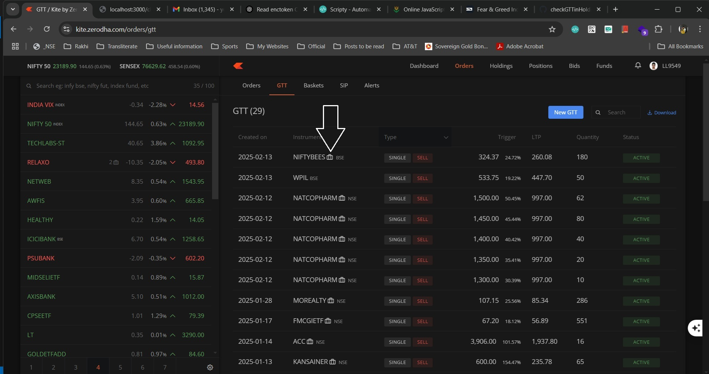

# checkGTTinHoldingsZerodha
This script will check if the GTT order placed is present in Holdings or not. If present it will add a suitcase to the stock name. This will work only on zerodha GTT screen

1. Install scripty extension from https://scripty.abhisheksatre.com/#/store
2. Find validateGTT extension

   That is all you need to do.

